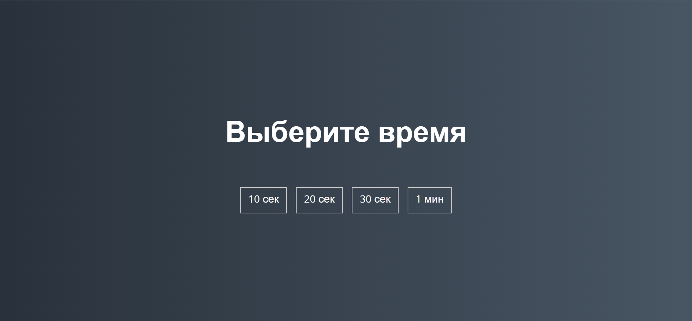

# Mini-game
### Описание 

Игра-счетчик. С помощью нее можно тренировать мелкую моторику и навыки владению 🐁

Стек:
- JS
- HTML
- CSS

Как играть:
1. Переходим в [demo](https://bloodw1n.github.io/Mini-game/)
2. Нажимаем "Начать игру"
3. Выбираем время игры
4. Нажимаем на кружочки. Они будут убегать - поспеши!
5. Смотрим на результат
6. Удовлетворяемся :)

 
 
 
 

